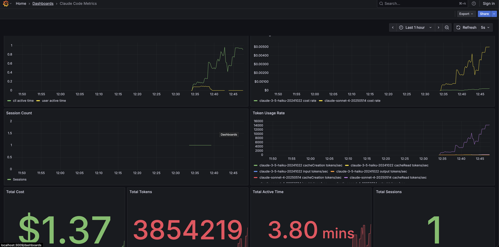
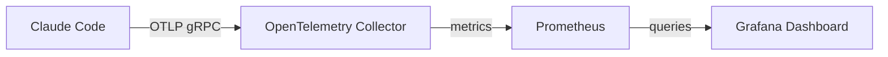

# Claude Code OpenTelemetry Monitoring

This repository provides a complete monitoring stack for Claude Code telemetry data using OpenTelemetry, Prometheus, and Grafana.



## Architecture



## Quick Start

### 1. Start the monitoring stack

```bash
git clone https://github.com/alileza/claude-otlp-example.git
cd claude-otlp-example
docker-compose up -d
```

This will start:
- OpenTelemetry Collector on ports 4317 (gRPC) and 4318 (HTTP)
- Prometheus on port 9099
- Grafana on port 3009

### 2. Configure Claude Code telemetry

Set the following environment variables to enable Claude Code to send telemetry to the OTEL Collector:

```bash
export CLAUDE_CODE_ENABLE_TELEMETRY=1
export OTEL_METRICS_EXPORTER=otlp
export OTEL_LOGS_EXPORTER=otlp
export OTEL_EXPORTER_OTLP_PROTOCOL=grpc
export OTEL_EXPORTER_OTLP_ENDPOINT=http://localhost:4317
export OTEL_SERVICE_NAME="claude-code"
export OTEL_RESOURCE_ATTRIBUTES="service.name=claude-code,service.version=1.0.0"
```

### 3. Start using Claude Code

Use Claude Code as normal - telemetry will automatically be collected and sent to the monitoring stack.

### 4. View the dashboard

Open **http://localhost:3009** in your browser - no login required! The Claude Code metrics dashboard will load immediately as the homepage.

## Available Metrics

The dashboard displays the following Claude Code telemetry:

- `claude_code_claude_code_active_time_seconds_total` - Time spent actively using Claude Code
- `claude_code_claude_code_cost_usage_USD_total` - Cost breakdown by model
- `claude_code_claude_code_session_count_total` - Number of CLI sessions started
- `claude_code_claude_code_token_usage_tokens_total` - Token usage by type (input/output/cache)

## Access Points

- **Grafana Dashboard**: http://localhost:3009 (no login required)
- **Prometheus**: http://localhost:9099
- **OTEL Collector metrics**: http://localhost:8889/metrics

